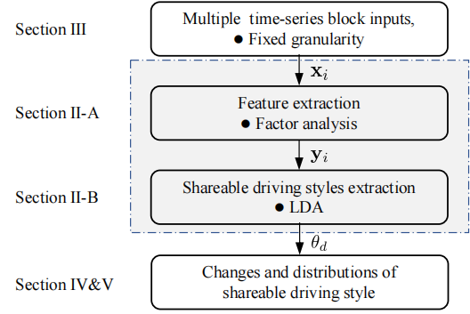
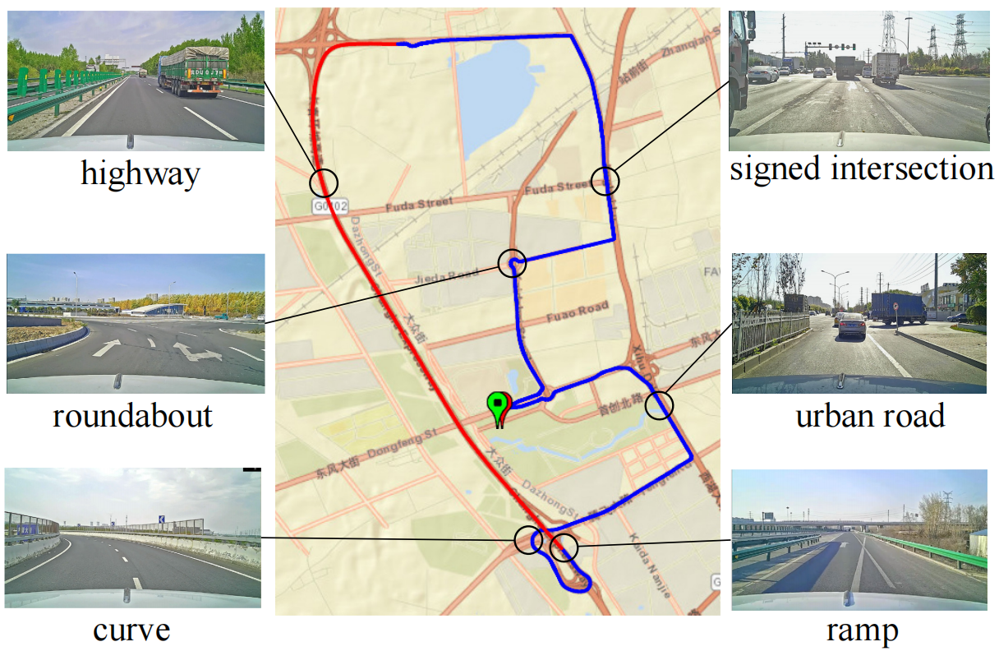
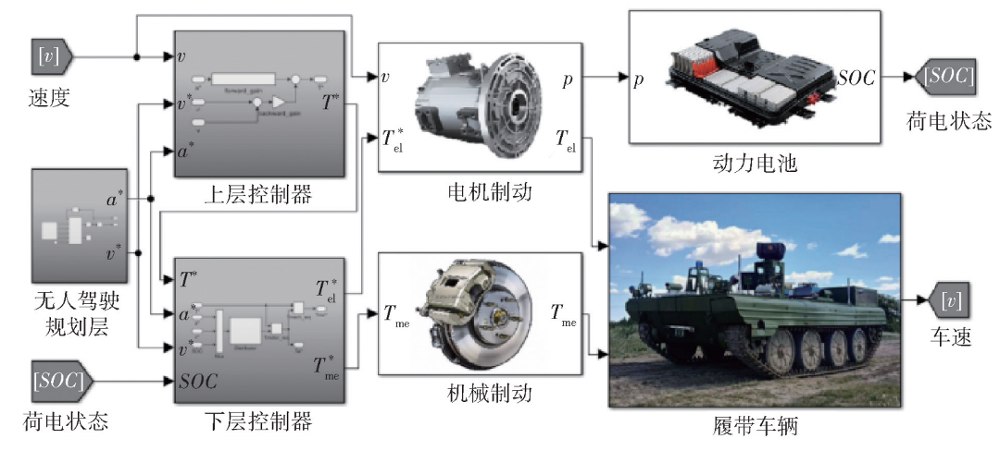
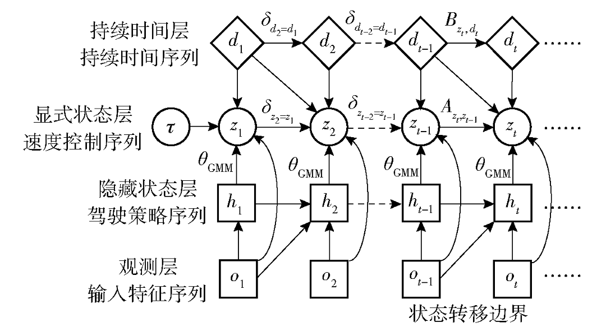

<!--

  You can also find my articles on <u><a href="{{author.googlescholar}}">my Google Scholar profile</a>.</u>



  

-->

<!-- ## Dissertation
- **W. Wang**. (2018) Adaptive Control of Personalized Driver Assistance Systems. *Ph.D., Mechanical Engineering, Beijing Institute of Technology* (SAE-China Best Dissertation Awards) -->

## Journal/Conference
<!-- 
*Corresponding Author -->

<table style="width:100%">
    <thead>
		<tr>
			<th width="20%">Highlight</th>
			<th width="15%">Authors</th>
			<th width="43%">Title</th>
			<th width="2%">Year</th>
			<th width="20%">Journal/Proceedings</th>
		</tr>
    </thead>
	<tbody>
  <tr id="wang2022trustworthy" class="entry">
          <td>
        

          
          <!-- 

          Local Prior Sensitivity
          
 -->
        

      </td>
          <td><strong>C. Zhang</strong>,  W. Wang, et al.</td>
      <td>
        Inter-Individual Shareable Driving Style Analysis using CAN Signals with Latent Dirichlet Allocation 
                
 
                  [<a href="javascript:toggleInfo('zhang2023shareable','abstract')">Abstract</a>]
                  <!-- [<a href="javascript:toggleInfo('zhang2023shareable','bibtex')">BibTeX</a>]  -->
                  <!-- [<a href="https://ieeexplore.ieee.org/abstract/document/8956222">PDF</a>] -->
                  <!--[<a href="https://arxiv.org/abs/2210.08256">arXiv</a>] -->
                  <!-- [<a href="http://tps.uwstarlab.org/">Website</a>] -->
                  <!-- [<a href="https://zhiyongcui.com/blog/2020/07/16/graph-markov-network.html">Post</a>] -->
                  <!-- [<a href="https://github.com/zhiyongc/GraphMarkovNetwork">Code</a>] -->
                  <!-- [<a href="https://github.com/zhiyongc/Graph_Convolutional_LSTM">code</a>] -->
              

        </td>
      <td>2023</td>
      <td>IEEE Transactions on Intelligent Transportation Systems (Under review)</td>
  </tr>
  <tr id="abs_zhang2023shareable" class="abstract noshow">
      <td colspan="5">
 <b>Abstract</b>: Human driving behavior can recognize their driving style. Despite this, it remains pending (i) how the driving style of a naturally aggressive or calm person would evolve and manifest along their driving behavior and (ii) how one individual's driving behavior relates to another driver's behavior. Our insight is that individuals' driving behavior is a sequence of responses/executions to the mixture of some inter-individual shareable latent driving styles inherent in their minds. This paper presents a generic statistical framework to quantitatively analyze the changes in an individual's driving styles that are shareable among individuals.  To learn and analyze these driving styles, we segment sequential driving operations over a temporal space into a fixed granularity as the elemental components of driving styles and formulate the learning task as a topic-extraction problem with latent Dirichlet allocation (LDA). The validation and verification were conducted with 100 drivers in different driving settings, ranging from urban to highway. Experimental results show that our proposed framework can effectively learn the shareable driving styles and describe the dynamic process of driving behavior. We found that three driving styles learned from driving behavior are shared among individual drivers. Naturally aggressive drivers usually have a higher proportion of aggressiveness than other drivers, but they can be calmer according to factors such as the traffic environment. 

    </td>
  </tr>
  <tr id="zhang2023dataset" class="entry">
          <td>
        

          
          <!-- 

          Local Prior Sensitivity
          
 -->
        

      </td>
          <td><strong>C. Zhang</strong>,  W. Wang, et al.</td>
      <td>
        100 Drivers, 2200 km: A Natural Dataset of Driving Styles toward Human-centered Intelligent Driving Systems  
                
 
                  [<a href="javascript:toggleInfo('zhang2023dataset','abstract')">Abstract</a>]
                <!-- [<a href="javascript:toggleInfo('zhang2022coordinatedcontrol','bibtex')">BibTeX</a>] -->
                  <!-- [<a href="https://ieeexplore.ieee.org/abstract/document/8956222">PDF</a>] -->
                  <!--[<a href="https://arxiv.org/abs/2210.08256">arXiv</a>]-->
                  <!-- [<a href="http://tps.uwstarlab.org/">Website</a>] -->
                  <!-- [<a href="https://zhiyongcui.com/blog/2020/07/16/graph-markov-network.html">Post</a>] -->
                  <!-- [<a href="https://github.com/zhiyongc/GraphMarkovNetwork">Code</a>] -->
                  <!-- [<a href="https://github.com/zhiyongc/Graph_Convolutional_LSTM">code</a>] -->
              

        </td>
      <td>2023</td>
      <td>2023 IEEE Intelligent Vehicles Symposium (under review)</td>
  </tr>
  <tr id="abs_zhang2023dataset" class="abstract noshow">
      <td colspan="5">
 <b>Abstract</b>: Effective driving style analysis is critical to developing human-centered intelligent driving systems that consider drivers' preferences. However, the approaches and conclusions of most related studies are diverse and inconsistent because no unified datasets tagged with driving styles exist as a reliable benchmark. The absence of explicit driving style labels makes verifying different approaches and algorithms difficult. This paper provides a new benchmark by constructing a Natural Dataset of Driving Style (NDDStyle) tagged with the subjective evaluation of 100 drivers' driving styles. In our dataset, the subjective quantification of each driver's driving style is from themselves and an expert according to the Likert-scale questionnaire. The testing routes are selected to cover various driving scenarios, including highways, urban, high-way ramps, and signalized traffic. The collected driving data consists of lateral and longitudinal manipulation information collected from CAN, including steering angle, steering speed, lateral acceleration, throttle position, throttle rate, brake pressure, etc. This driving-style dataset is the first to provide detailed manipulation data with driving-style tags.   

    </td>
   </tr>
<!--   <tr id="zhang2022coordinatedcontrol" class="entry">
          <td>
        

          
          <!-- 

          Local Prior Sensitivity
          

        

      </td>
          <td><strong>C. Zhang</strong>,  Q. Liu, et al.</td>
      <td>
        Coordinated Control of Electric-mechanical Braking System for Unmanned Tracked Vehicles 
                
 
                  [<a href="javascript:toggleInfo('zhang2022coordinatedcontrol','abstract')">Abstract</a>]
                 [<a href="javascript:toggleInfo('zhang2022coordinatedcontrol','bibtex')">BibTeX</a>] 
                  <!-- [<a href="https://ieeexplore.ieee.org/abstract/document/8956222">PDF</a>] -->
                  <!--[<a href="https://arxiv.org/abs/2210.08256">arXiv</a>]-->
                  <!-- [<a href="http://tps.uwstarlab.org/">Website</a>] -->
                  <!-- [<a href="https://zhiyongcui.com/blog/2020/07/16/graph-markov-network.html">Post</a>] -->
                  <!-- [<a href="https://github.com/zhiyongc/GraphMarkovNetwork">Code</a>] -->
                  <!-- [<a href="https://github.com/zhiyongc/Graph_Convolutional_LSTM">code</a>] -->
              

        </td>
      <td>2022</td>
      <td>Acta Armamentarii</td>
  </tr>
   <tr id="abs_zhang2022coordinatedcontrol" class="abstract noshow">
      <td colspan="5">
 <b>Abstract</b>: Unmanned dual-motor electric drive tracked vehicles have large braking control tracking errors due to poor coordination performance between mechanical and electric systems. To solve this problem, a hierarchical controller is proposed. In the upper controller, a feedforward-feedback controller is constructed based on the expected deceleration sequence of the unmanned driving system. The expected deceleration is used as the feedforward input to compensate the target braking torque, and the speed error is used as the feedback input to correct the target torque difference. In the lower controller, a braking force distribution algorithm is established based on fuzzy control, which combines the characteristics of mechanical braking and motor braking. The vehicle test shows that compared with the speed segmented controller, the hierarchical controller can accurately track the expected speed sequence with the speed tracking error reduced by 60.1% and the acceleration standard deviation reduced by 39.4%. The target tracking accuracy of the brake control of the unmanned dual-motor electric drive tracked vehicle is improved.  

    </td>
   </tr>
   <tr id="bib_zhang2022coordinatedcontrol" class="bibtex noshow">
          <td colspan="5"><b>BibTeX</b>:
                <pre>@article{chaopeng43coordinated,
  title={Coordinated Control of Electric-mechanical Braking System for Unmanned Tracked Vehicles},
  author={Chaopeng, ZHANG and Qingxiao, LIU and Haotian, DONG and Huiyan, CHEN and Junqiang, XI},
  journal={Acta Armamentarii},
  volume={43},
  number={11},
  pages={2727}
}
                </pre>
        </td>
  </tr>
  <tr id="liu2022decision-making" class="entry">
          <td>
        

          
          <!-- 

          Local Prior Sensitivity
          
 -->
        

      </td>
          <td>Q. Liu, Z. Tang, <strong>C. Zhang</strong>,   et al.</td>
      <td>
        Research on GMM-HSMM-based Longitudinal Decision-making System for Two-side Independent Electric Unmanned TrackedPlatform 
                
 
                  [<a href="javascript:toggleInfo('liu2022decision-making','abstract')">Abstract</a>]
                 [<a href="javascript:toggleInfo('liu2022decision-making','bibtex')">BibTeX</a>] 
                  <!-- [<a href="https://ieeexplore.ieee.org/abstract/document/8956222">PDF</a>] -->
                  <!--[<a href="https://arxiv.org/abs/2210.08256">arXiv</a>]-->
                  <!-- [<a href="http://tps.uwstarlab.org/">Website</a>] -->
                  <!-- [<a href="https://zhiyongcui.com/blog/2020/07/16/graph-markov-network.html">Post</a>] -->
                  <!-- [<a href="https://github.com/zhiyongc/GraphMarkovNetwork">Code</a>] -->
                  <!-- [<a href="https://github.com/zhiyongc/Graph_Convolutional_LSTM">code</a>] -->
              

        </td>
      <td>2022</td>
      <td>Acta Armamentarii</td>
  </tr> 
     <tr id="abs_liu2022decision-making" class="abstract noshow">
      <td colspan="5">
 <b>Abstract</b>:  Atpresent, theresearch on the kinematics- and dynamics-based longitudinal decision-making system of electric unmanned tracked vehicles are confronted with problems such as poor adaptability and difficulty to obtain accurate model parameters. Aiming at the driving scenarios of the unmanned tracked vehicle straight-linedriving and approaching obstacles, this study introduces the longitudinal decision-making mechanism for driversby analyzing the driving data and constructsa model usingthe combination of Gaussian Mixture Model (GMM) and Hidden Semi-Markov Model (HSMM) to simulate the longitudinal decision-making process of experienced drivers. In the GMM-HSMM system, the GMM is utilized to identify the driving intention as well as cluster and quantifythe driving behavior duringtheobstacle-approachingprocess;the HSMM is applied to model the decision transfer process and the duration of the same decision. This system is verified by a real platform under different road conditions. The experimental results indicate that the proposed driver model canwellsimulate the longitudinal decision-making mechanismfor drivers,where the acceleration is limited to 3.5 m/s2, the deceleration is larger than -4.5 m/s2, andthe average value of absolute acceleration at the decision boundary approaches 0.8 m/s2. Meanwhile, the GMM-HSMM-basedsystem is shown to be able to adapt to different road conditions withoutrelying on accurate road parameters by retraining the decision durationdistribution. 

    </td>
   </tr>
   <tr id="bib_liu2022decision-making" class="bibtex noshow">
          <td colspan="5"><b>BibTeX</b>:
                <pre>@article{qingxiao2022research,
  title={Research on GMM-HSMM-based Longitudinal Decision-making System for Two-side Independent Electric Unmanned TrackedPlatform},
  author={Qingxiao, LIU and Zeyue, TANG and Chaopeng, ZHANG and Hai'ou, LIU and Huiyan, CHEN},
  journal={Acta Armamentarii},
  volume={43},
  number={8},
  pages={1733},
  year={2022}
}
                </pre>
        </td>
  </tr>   -->
	</tbody>
</table>

<!-- ## Patents
4. **Wenshuo Wang**, Aditya Ramesh, Ding Zhao. [Unsurpervised classification of encountering scenarios using connected vehicle datasets](https://patents.google.com/patent/US20200133269A1/en). US20200133269A1, USA, 2020 -->

