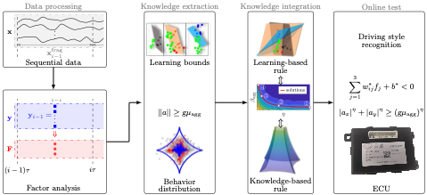
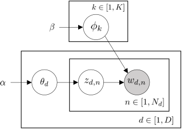

<!--

  You can also find my articles on <u><a href="{{author.googlescholar}}">my Google Scholar profile</a>.</u>



  

-->

<!-- ## Dissertation
- **W. Wang**. (2018) Adaptive Control of Personalized Driver Assistance Systems. *Ph.D., Mechanical Engineering, Beijing Institute of Technology* (SAE-China Best Dissertation Awards) -->

## Journal/Conference
<!-- 
*Corresponding Author -->

<table style="width:100%">
    <thead>
		<tr>
			<th width="20%">Highlight</th>
			<th width="15%">Authors</th>
			<th width="43%">Title</th>
			<th width="2%">Year</th>
			<th width="20%">Journal/Proceedings</th>
		</tr>
    </thead>
	<tbody>
  <tr id="zhang2024embedded" class="entry">
          <td>
        

          
          <!-- 

          Local Prior Sensitivity
          
 -->
        

      </td>
          <td><strong>C. Zhang</strong>,  W. Wang, et al.</td>
      <td>
        An Embedded Driving Style Recognition Approach: Leveraging Knowledge in Learning 
                
 
                  [<a href="javascript:toggleInfo('zhang2024embedded','abstract')">Abstract</a>]
                  <!-- [<a href="javascript:toggleInfo('zhang2024embedded','bibtex')">BibTeX</a>]  -->
                  [<a href="https://ieeexplore.ieee.org/abstract/document/10423807">PDF</a>]
                  <!--[<a href="https://arxiv.org/abs/2210.08256">arXiv</a>] -->
                  <!-- [<a href="http://tps.uwstarlab.org/">Website</a>] -->
                  <!-- [<a href="https://zhiyongcui.com/blog/2020/07/16/graph-markov-network.html">Post</a>] -->
                  <!-- [<a href="https://github.com/zhiyongc/GraphMarkovNetwork">Code</a>] -->
                  <!-- [<a href="https://github.com/zhiyongc/Graph_Convolutional_LSTM">code</a>] -->
              

        </td>
      <td>2024</td>
      <td>IEEE Transactions on Intelligent Vehicles </td>
  </tr>
  <tr id="abs_zhang2024shareable" class="abstract noshow">
      <td colspan="5">
 <b>Abstract</b>: Online driving style recognition can enhance the customization of human-centric driving systems, thereby improving comfort, safety, and fuel economy. However, the limited performance of automotive-grade chips makes it highly challenging to compile and run complicated algorithms in real time. To overcome this bottleneck, this paper proposes an embedded method for recognizing driving styles, which is computationally efficient. This approach leverages experts' prior knowledge in learning algorithms and applies it to the electronic control unit (ECU) characterized by a limited RAM. More specifically, the approach integrates knowledge-based rules and learning-based rules. The design of knowledge-based rules relies on the correlation between driving styles and vehicle dynamics (i.e., friction circle). Learning-based rules are established as explicit hyperplanes extracted through hierarchical clustering and support vector machine analysis of the naturalistic driving behaviors exhibited by 100 drivers. These knowledge- and learning-based rules are then integrated into an embedded driving style recognition model. The resulting model is compiled into an executable file that operates within the vehicle's onboard ECU. The proposed method is validated through real vehicle testing in naturalistic driving settings, demonstrating a remarkable 94.4% level of subjective-objective consistency.

    </td>
  </tr>
  <tr id="zhang2024shareable" class="entry">
          <td>
        

          
          <!-- 

          Local Prior Sensitivity
          
 -->
        

      </td>
          <td><strong>C. Zhang</strong>,  W. Wang, et al.</td>
      <td>
        Shareable Driving Style Learning and Analysis With a Hierarchical Latent Model 
                
 
                  [<a href="javascript:toggleInfo('zhang2024shareable','abstract')">Abstract</a>]
                  <!-- [<a href="javascript:toggleInfo('zhang2024shareable','bibtex')">BibTeX</a>]  -->
                  [<a href="https://ieeexplore.ieee.org/abstract/document/10478205">PDF</a>]
                  <!--[<a href="https://arxiv.org/abs/2210.08256">arXiv</a>] -->
                  <!-- [<a href="http://tps.uwstarlab.org/">Website</a>] -->
                  <!-- [<a href="https://zhiyongcui.com/blog/2020/07/16/graph-markov-network.html">Post</a>] -->
                  <!-- [<a href="https://github.com/zhiyongc/GraphMarkovNetwork">Code</a>] -->
                  <!-- [<a href="https://github.com/zhiyongc/Graph_Convolutional_LSTM">code</a>] -->
              

        </td>
      <td>2024</td>
      <td>IEEE Transactions on Intelligent Transportation Systems </td>
  </tr>
  <tr id="abs_zhang2024shareable" class="abstract noshow">
      <td colspan="5">
 <b>Abstract</b>: Driving style is usually used to characterize driving behavior for a driver or a group of drivers. However, it remains unclear how one individual’s driving style shares certain common grounds with other drivers. Our insight is that driving behavior is a sequence of responses to the weighted mixture of latent driving styles that are shareable within and between individuals. To this end, this paper develops a hierarchical latent model to learn the relationship between driving behavior and driving styles. We first propose a fragment-based approach to represent complex sequential driving behavior in a low-dimension feature space. Then, we provide an analytical formulation for the interaction of driving behavior and shareable driving styles through a hierarchical latent model. This model successfully extracts latent driving styles from extensive driving behavior data without the need for manual labeling, offering an interpretable statistical structure. Through real-world testing involving 100 drivers, our developed model is validated, demonstrating a subjective-objective consistency exceeding 90%, outperforming the benchmark method. Experimental results reveal that individuals share driving styles within and between them. We also found that individuals inclined towards aggressiveness only exhibit a higher proportion of such behavior rather than persisting consistently to be aggressive. 

    </td>
  </tr>
  <tr id="zhang2023dataset" class="entry">
          <td>
        

          
          <!-- 

          Local Prior Sensitivity
          
 -->
        

      </td>
          <td><strong>C. Zhang</strong>,  W. Wang, et al.</td>
      <td>
        100 Drivers, 2200 km: A Natural Dataset of Driving Styles toward Human-centered Intelligent Driving Systems  
                
 
                  [<a href="javascript:toggleInfo('zhang2023dataset','abstract')">Abstract</a>]
                <!-- [<a href="javascript:toggleInfo('zhang2022coordinatedcontrol','bibtex')">BibTeX</a>] -->
                  <!-- [<a href="https://ieeexplore.ieee.org/abstract/document/8956222">PDF</a>] -->
                  <!--[<a href="https://arxiv.org/abs/2210.08256">arXiv</a>]-->
                  <!-- [<a href="http://tps.uwstarlab.org/">Website</a>] -->
                  <!-- [<a href="https://zhiyongcui.com/blog/2020/07/16/graph-markov-network.html">Post</a>] -->
                  <!-- [<a href="https://github.com/zhiyongc/GraphMarkovNetwork">Code</a>] -->
                  <!-- [<a href="https://github.com/zhiyongc/Graph_Convolutional_LSTM">code</a>] -->
              

        </td>
      <td>2024</td>
      <td>2024 IEEE Intelligent Vehicles Symposium (in press)</td>
  </tr>
  <tr id="abs_zhang2024dataset" class="abstract noshow">
      <td colspan="5">
 <b>Abstract</b>: Effective driving style analysis is critical to developing human-centered intelligent driving systems that consider drivers’ preferences. However, the approaches and conclusions of most related studies are diverse and inconsistent because no unified datasets tagged with driving styles exist as a reliable benchmark. The absence of explicit driving style labels makes verifying different approaches and algorithms difficult. This paper provides a new benchmark by constructing a natural dataset of Driving Style (100-DrivingStyle) tagged with the subjective evaluation of 100 drivers’ driving styles. In this dataset, the subjective quantification of each driver’s driving style is from themselves and an expert according to the Likertscale questionnaire. The testing routes are selected to cover various driving scenarios, including highways, urban, highway ramps, and signalized traffic. The collected driving data consists of lateral and longitudinal manipulation information, including steering angle, steering speed, lateral acceleration, throttle position, throttle rate, brake pressure, etc. This dataset is the first to provide detailed manipulation data with drivingstyle tags, and we demonstrate its benchmark function using six classifiers. 

    </td>
   </tr>
 
	</tbody>
</table>

<!-- ## Patents
4. **Wenshuo Wang**, Aditya Ramesh, Ding Zhao. [Unsurpervised classification of encountering scenarios using connected vehicle datasets](https://patents.google.com/patent/US20200133269A1/en). US20200133269A1, USA, 2020 -->

